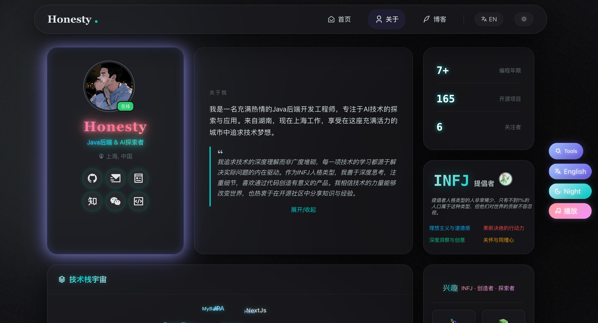

# Honesty's Personal Website

一个轻量、优雅、现代化个人主页，融合科技感与个性化元素，展示个人技术栈、开源项目和博客文章。白天模式强调阅读与信息密度，夜间模式带来渐变与微光的沉浸视觉。

<div align="center">

[](https://github.com/listener-He/Home/blob/main/LICENSE)
[](https://github.com/listener-He/Home/stargazers)
[](https://github.com/listener-He/Home/issues)

</div>

## 🌟 项目亮点

现代、响应式个人站点，融合美学设计与技术实力，打造专业个人品牌形象。

### 🎨 视觉设计特色

- **渐变美学**：精心设计的渐变色彩方案，营造现代感视觉体验
- **玻璃态效果**：白天柔和透明，夜间深色半透明，层次分明
- **沉浸式夜间模式**：微光特效与深色主题，保护视力同时提升质感
- **响应式布局**：完美适配桌面、平板、手机等各种设备

### 🚀 核心功能

- ✨ **渐变标题与微光夜间视觉**：仅标题保留渐变，正文统一实色，确保阅读清晰
- 🧊 **玻璃态卡片**：白天柔和、夜间半透明深色，兼顾层次与审美
- 🪐 **技术栈宇宙**：PC 端 3D 标签球；移动端三行无缝横向滚动
- 📦 **内容聚合**：GitHub 开源仓库（星标/分支信息）、RSS 最新文章聚合
- 💬 **评论互动**：Artalk 评论组件，移动端支持折叠/展开，桌/移端自适配样式
- 🌗 **主题与语言**：一键切换 Day/Night 与 CN/EN，自动缓存记忆
- ⚡ **性能与体验**：缓存字段精简、骨架占位与淡入过渡、异步抓取避免阻塞

## 🖼️ 页面预览

<div align="center">
  
  
  
</div>

## 🧩 页面结构

### 🏠 主页（index）
- 简洁直观的内容入口与导航
- 轻量、清晰、直达的用户体验

### 👤 关于页面（about）
- **Profile**：头像、在线状态、个性化标题与社交链接
- **Bio**：简介与格言，支持折叠/展开
- **Stats**：编程年限、开源项目数、关注者
- **MBTI**：人格代码、名称与四元素标签（白天实色高对比；夜间渐变微光）
- **Tech Universe**：PC 3D 标签球；移动端三行滚动标签
- **Interests**：两列卡片，圆角玻璃态，白天清爽、夜间半透明深色
- **Open Source**：GitHub 仓库列表，星标与分支信息
- **Latest Posts**：RSS 文章列表，标题/日期/分类
- **Comments**：Artalk 评论区域，桌/移端响应式优化

## ⚙️ 技术栈与工程细节

- **前端技术**：原生 JS、CSS 与 HTML，无框架依赖
- **评论系统**：Artalk 评论组件（HTTPS 环境启用；本地或非 HTTPS 显示关闭提示）
- **数据获取**：GitHub REST API 拉取用户与仓库信息（写缓存前字段精简）
- **内容聚合**：RSS 解析通过 DOMParser，失败时降级本地 JSON 或默认数据
- **交互体验**：骨架加载与淡入动画、移动端可拖拽悬浮工具、ARIA 辅助属性

## 🚀 快速开始

```bash
# 克隆项目
git clone https://github.com/listener-He/Home.git

# 进入项目目录
cd Home

# 直接打开 HTML 文件预览
open index.html
open about.html
```

站点配置位于 `js/config.js`，用于设置 GitHub 用户名、RSS 地址、缓存策略、Artalk 服务等。

## 📦 部署与自定义

请阅读《部署与自定义指南》获取详细说明：
- [DEPLOY.md](./DEPLOY.md)

## 🙏 鸣谢与致敬

本项目在开发过程中参考和借鉴了以下开源项目：

- [dmego/home.github.io](https://github.com/dmego/home.github.io) - 提供了个人主页的基础框架和设计思路
- [lqbby/Tech-Home](https://github.com/lqbby/Tech-Home) - 提供了技术实现方案和部分UI设计元素

向这些项目的作者表示诚挚的感谢！

同时感谢以下开源项目的支持：

- [Artalk](https://artalk.js.org/) - 评论系统
- [Remix Icon](https://remixicon.com/) - 图标库
- [Normalize.css](https://necolas.github.io/normalize.css/) 与 [BootCDN](https://www.bootcdn.cn/) - 页面基础与加速
- [GitHub](https://github.com/) 与 [RSS](https://www.rssboard.org/) 生态 - 内容聚合支持

## 📄 许可证

本项目采用 [MIT](./LICENSE) 许可证。

## 👨‍💻 作者

**Honesty (HeHouHui)**

- 博客: [blog.hehouhui.cn](https://blog.hehouhui.cn)
- GitHub: [@listener-He](https://github.com/listener-He)
- 邮箱: [hehouhui@foxmail.com](mailto:hehouhui@foxmail.com)

---

<div align="center">

欢迎提出改进建议，或将该站点作为你的个人主页模板进行自定义与二次开发。
</div>